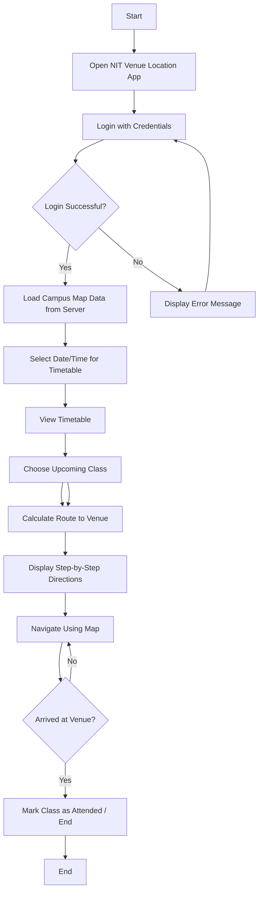

# Flowchart for Student Navigation Process

## Diagram (textual view)

Start → Open App → Login

Login → (success) → Load Campus Map Data → Select Date/Time → View Timetable → Choose Class → Get Location → Calculate Route → Display Directions → Navigate → Arrive → End

Login → (failure) → Display Error → Login

