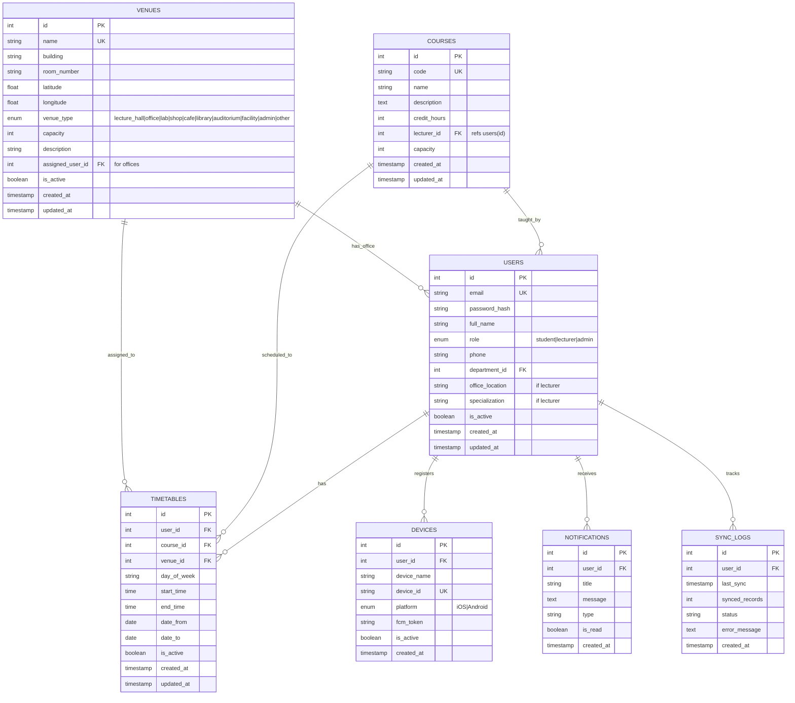

# Database Schema Documentation

This document describes the PostgreSQL database schema for the NIT Venue Location system.

## Overview

The database uses PostgreSQL v13+ with the following core entities:
- **USERS**: Students, lecturers, and administrators (unified with role-based field)
- **DEPARTMENTS**: Organizational units at NIT
- **COURSES**: Academic courses offered at NIT
- **TIMETABLES**: Course schedule assignments
- **VENUES**: All campus locations (lecture halls, offices, labs, shops, cafes, facilities, etc.)
- **NOTIFICATIONS**: System notifications for users
- **DEVICES**: Mobile device tracking for push notifications
- **SYNC_LOGS**: Track mobile app data synchronization

## Campus Hierarchy

The system represents the entire campus as a unified VENUES table with different types:

```
Campus (All Locations)
├── Buildings
│   ├── Block 23
│   │   ├── Lecture Halls (Class I, Class II)
│   │   ├── Offices (Dr. Smith's office, Dr. Johnson's office)
│   │   └── Other facilities
│   ├── Science Block
│   │   ├── Laboratories (Lab A, Lab B)
│   │   └── Lecture Halls (Room 200)
│   └── Main Building
│       ├── Auditorium
│       ├── Admin Offices
│       └── Other facilities
└── Campus-Wide Facilities
    ├── Library
    ├── Cafeteria
    ├── Bookshop
    └── Wellness Center
```

Each venue has:
- **name**: Unique identifier (e.g., "Block 15 - Room 101")
- **building**: Hierarchical organization (e.g., "Block 15", "Science Block")
- **venue_type**: Category for filtering and display
- **latitude/longitude**: GPS coordinates for Mapbox integration
- **capacity**: Max occupancy
- **assigned_user_id**: For offices, the assigned lecturer/admin
- **amenities**: Equipment and features available

---

## Entity-Relationship Diagram



---

## Table Definitions

### 1. USERS

Stores user account information (students, lecturers, admins). Lecturer-specific fields are included as nullable columns.

```sql
CREATE TABLE users (
    id SERIAL PRIMARY KEY,
    email VARCHAR(255) UNIQUE NOT NULL,
    password_hash VARCHAR(255) NOT NULL,
    full_name VARCHAR(255) NOT NULL,
    role ENUM ('student', 'lecturer', 'admin') NOT NULL DEFAULT 'student',
    phone VARCHAR(20),
    department_id INT REFERENCES departments(id),
    -- Lecturer-specific fields (nullable for all users)
    office_location VARCHAR(255),
    specialization VARCHAR(255),
    is_active BOOLEAN DEFAULT true,
    created_at TIMESTAMP DEFAULT CURRENT_TIMESTAMP,
    updated_at TIMESTAMP DEFAULT CURRENT_TIMESTAMP
);

CREATE INDEX idx_users_email ON users(email);
CREATE INDEX idx_users_role ON users(role);
CREATE INDEX idx_users_department_id ON users(department_id);
```

**Fields:**
- `id`: Unique user identifier
- `email`: Login credential, must be unique
- `password_hash`: Bcrypt hashed password (never store plaintext)
- `full_name`: User's full name
- `role`: One of student, lecturer, or admin
- `phone`: Contact number
- `department_id`: Foreign key to departments (optional)
- `office_location`: Optional office location for lecturers (access via venues in timetables)
- `specialization`: Lecturer's area of expertise (lecturers only)
- `is_active`: Soft delete flag (inactive users shouldn't login)
- `created_at`, `updated_at`: Timestamps for auditing

---

### 2. DEPARTMENTS

Organizational units at NIT.

```sql
CREATE TABLE departments (
    id SERIAL PRIMARY KEY,
    name VARCHAR(255) UNIQUE NOT NULL,
    code VARCHAR(50) UNIQUE NOT NULL,
    description TEXT,
    head_id INT REFERENCES users(id),
    created_at TIMESTAMP DEFAULT CURRENT_TIMESTAMP,
    updated_at TIMESTAMP DEFAULT CURRENT_TIMESTAMP
);

CREATE INDEX idx_departments_name ON departments(name);
```

**Fields:**
- `id`: Unique department identifier
- `name`: Department name (e.g., "Computer Science", "Mechanical Engineering")
- `code`: Short code (e.g., "CS", "ME")
- `description`: Details about the department
- `head_id`: FK to users (department head/admin)

---

### 3. COURSES

All campus locations (lecture halls, offices, labs, shops, facilities, etc.). Each venue is marked with a type for filtering and categorization.

```sql
CREATE TABLE venues (
    id SERIAL PRIMARY KEY,
    name VARCHAR(255) UNIQUE NOT NULL,
    building VARCHAR(100) NOT NULL,
    room_number VARCHAR(50),
    floor_number INT,
    latitude DECIMAL(10, 8) NOT NULL,
    longitude DECIMAL(11, 8) NOT NULL,
    venue_type ENUM (
        'lecture_hall',
        'office',
        'lab',
        'shop',
        'cafe',
        'library',
        'auditorium',
        'facility',
        'admin',
        'other'
    ) NOT NULL,
    capacity INT,
    description TEXT,
    accessibility VARCHAR(100),
    amenities TEXT,
    assigned_user_id INT REFERENCES users(id),
    image_url VARCHAR(500),
    is_active BOOLEAN DEFAULT true,
    created_at TIMESTAMP DEFAULT CURRENT_TIMESTAMP,
    updated_at TIMESTAMP DEFAULT CURRENT_TIMESTAMP
);

CREATE INDEX idx_venues_name ON venues(name);
CREATE INDEX idx_venues_building ON venues(building);
CREATE INDEX idx_venues_type ON venues(venue_type);
CREATE INDEX idx_venues_location ON venues(latitude, longitude);
CREATE INDEX idx_venues_assigned_user ON venues(assigned_user_id);
```

**Fields:**
- `id`: Unique venue identifier
- `name`: Venue name (e.g., "Block 15 Room 101", "Dr. Smith's Office")
- `building`: Building name (e.g., "Block 15", "Science Block")
- `room_number`: Room identifier within building
- `floor_number`: Which floor (optional)
- `latitude`, `longitude`: GPS coordinates (for Mapbox)
- `venue_type`: Type of location (lecture_hall, office, lab, shop, cafe, library, auditorium, facility, admin, other)
- `capacity`: Maximum occupancy
- `description`: Details (equipment, hours, access notes)
- `accessibility`: Wheelchair access, elevator, stairs, ramp info
- `amenities`: Projectors, whiteboards, WiFi, power outlets, etc.
- `assigned_user_id`: For offices, the lecturer/admin assigned to that office
- `image_url`: Photo of the venue
- `is_active`: Active/inactive flag

**Venue Types:**
- `lecture_hall`: Classrooms and teaching spaces
- `office`: Faculty and staff offices
- `lab`: Computer labs, science labs, workshops
- `shop`: Bookshop, supplies, merchandise stores
- `cafe`: Cafeteria, coffee shop, food areas
- `library`: Study and library facilities
- `auditorium`: Large lecture halls
- `facility`: Wellness center, gym, counseling, etc.
- `admin`: Administrative offices
- `other`: Miscellaneous campus locations

---

### 5. COURSES

Academic courses offered at NIT.

```sql
CREATE TABLE courses (
    id SERIAL PRIMARY KEY,
    code VARCHAR(50) UNIQUE NOT NULL,
    name VARCHAR(255) NOT NULL,
    description TEXT,
    credit_hours INT DEFAULT 3,
    lecturer_id INT NOT NULL REFERENCES users(id),
    department_id INT NOT NULL REFERENCES departments(id),
    capacity INT DEFAULT 60,
    is_active BOOLEAN DEFAULT true,
    created_at TIMESTAMP DEFAULT CURRENT_TIMESTAMP,
    updated_at TIMESTAMP DEFAULT CURRENT_TIMESTAMP
);

CREATE INDEX idx_courses_code ON courses(code);
CREATE INDEX idx_courses_lecturer_id ON courses(lecturer_id);
CREATE INDEX idx_courses_department_id ON courses(department_id);
```

**Fields:**
- `id`: Unique course identifier
- `code`: Course code (e.g., "CS101", "ME201")
- `name`: Course name (e.g., "Data Structures", "Thermodynamics")
- `description`: Course overview
- `credit_hours`: Academic credits
- `lecturer_id`: FK to users (course instructor)
- `department_id`: FK to departments
- `capacity`: Max students allowed
- `is_active`: Active/inactive flag

---

### 5. TIMETABLES

---

### 6. NOTIFICATIONS

System notifications sent to users.

```sql
CREATE TABLE notifications (
    id SERIAL PRIMARY KEY,
    user_id INT NOT NULL REFERENCES users(id) ON DELETE CASCADE,
    title VARCHAR(255) NOT NULL,
    message TEXT NOT NULL,
    type VARCHAR(50) NOT NULL,
    related_entity_type VARCHAR(50),
    related_entity_id INT,
    is_read BOOLEAN DEFAULT false,
    read_at TIMESTAMP,
    created_at TIMESTAMP DEFAULT CURRENT_TIMESTAMP
);

CREATE INDEX idx_notifications_user_id ON notifications(user_id);
CREATE INDEX idx_notifications_user_created ON notifications(user_id, created_at DESC);
CREATE INDEX idx_notifications_is_read ON notifications(user_id, is_read);
```

**Fields:**
- `id`: Unique notification identifier
- `user_id`: FK to users (recipient)
- `title`: Notification title
- `message`: Notification body
- `type`: Category (schedule, venue, general, alert)
- `related_entity_type`: What changed (timetable, venue, etc.)
- `related_entity_id`: ID of the changed entity
- `is_read`: Mark as read
- `read_at`: When user read the notification

**Notification Types:**
- `schedule_change`: Timetable modified
- `venue_change`: Venue details updated
- `reminder`: Upcoming class reminder
- `general`: System announcements
- `alert`: Urgent notifications

---

### 7. DEVICES

Track mobile devices for push notifications.

```sql
CREATE TABLE devices (
    id SERIAL PRIMARY KEY,
    user_id INT NOT NULL REFERENCES users(id) ON DELETE CASCADE,
    device_name VARCHAR(255),
    device_id VARCHAR(255) UNIQUE NOT NULL,
    platform VARCHAR(50) NOT NULL,
    fcm_token VARCHAR(500),
    app_version VARCHAR(20),
    os_version VARCHAR(20),
    is_active BOOLEAN DEFAULT true,
    last_used TIMESTAMP,
    created_at TIMESTAMP DEFAULT CURRENT_TIMESTAMP,
    updated_at TIMESTAMP DEFAULT CURRENT_TIMESTAMP
);

CREATE INDEX idx_devices_user_id ON devices(user_id);
CREATE INDEX idx_devices_fcm_token ON devices(fcm_token);
CREATE INDEX idx_devices_device_id ON devices(device_id);
```

**Fields:**
- `id`: Unique device identifier
- `user_id`: FK to users
- `device_name`: User-friendly name (e.g., "My iPhone")
- `device_id`: Hardware/OS device identifier
- `platform`: iOS or Android
- `fcm_token`: Firebase Cloud Messaging token (for push notifications)
- `app_version`: Installed app version
- `os_version`: Operating system version
- `last_used`: Last activity timestamp

---

### 8. SYNC_LOGS

Track mobile app synchronization for offline support.

```sql
CREATE TABLE sync_logs (
    id SERIAL PRIMARY KEY,
    user_id INT NOT NULL REFERENCES users(id) ON DELETE CASCADE,
    device_id INT REFERENCES devices(id),
    last_sync TIMESTAMP NOT NULL,
    sync_type VARCHAR(50),
    synced_records INT DEFAULT 0,
    status VARCHAR(50),
    error_message TEXT,
    duration_ms INT,
    created_at TIMESTAMP DEFAULT CURRENT_TIMESTAMP
);

CREATE INDEX idx_sync_logs_user_id ON sync_logs(user_id);
CREATE INDEX idx_sync_logs_device_id ON sync_logs(device_id);
CREATE INDEX idx_sync_logs_created ON sync_logs(created_at DESC);
```

**Fields:**
- `id`: Unique sync log entry
- `user_id`: FK to users
- `device_id`: FK to devices
- `last_sync`: Timestamp of the sync
- `sync_type`: full, incremental, etc.
- `synced_records`: Number of records synced
- `status`: success, partial, failed
- `error_message`: Error details if failed
- `duration_ms`: How long sync took

---

## Data Constraints & Validations

### Foreign Keys
- All foreign keys enforce referential integrity
- CASCADE delete on user deletion (cascades to timetables, notifications, devices, sync_logs)
- RESTRICT on course/venue deletion (prevents orphaned timetables)

### Unique Constraints
- `users.email` - Must be unique (login credential)
- `courses.code` - Must be unique (CS101 can't appear twice)
- `venues.name` - Must be unique (room names must be distinct)
- `devices.device_id` - Must be unique (hardware ID)

### Check Constraints
```sql
ALTER TABLE courses ADD CONSTRAINT check_credit_hours 
    CHECK (credit_hours > 0 AND credit_hours <= 6);

ALTER TABLE venues ADD CONSTRAINT check_capacity 
    CHECK (capacity > 0);

ALTER TABLE timetables ADD CONSTRAINT check_times 
    CHECK (start_time < end_time);

ALTER TABLE timetables ADD CONSTRAINT check_dates 
    CHECK (date_from <= date_to);
```

## Sample Data Requirements

### Initial Seed Data

```sql
-- Departments
INSERT INTO departments (name, code, description) VALUES
('Computer Science', 'CS', 'Department of Computer Science and Engineering'),
('Mechanical Engineering', 'ME', 'Department of Mechanical Engineering'),
('Civil Engineering', 'CE', 'Department of Civil Engineering');

-- Admin User
INSERT INTO users (email, password_hash, full_name, role, department_id) 
VALUES ('admin@nit.ac.tz', '$2b$10$...hashed...', 'Administrator', 'admin', 1);

-- Sample Lecturer
INSERT INTO users (email, password_hash, full_name, role, department_id, office_location, specialization) 
VALUES ('smith@nit.ac.tz', '$2b$10$...hashed...', 'Dr. John Smith', 'lecturer', 1, 'Block 15 Room 50', 'Database Systems');

-- Sample Student
INSERT INTO users (email, password_hash, full_name, role, department_id) 
VALUES ('student@nit.ac.tz', '$2b$10$...hashed...', 'Alice Johnson', 'student', 1);

-- Venues (Lecture Halls)
INSERT INTO venues (name, building, room_number, floor_number, latitude, longitude, venue_type, capacity, accessibility, amenities) VALUES
('Block 15 - Room 101', 'Block 15', '101', 1, -6.8799, 39.2034, 'lecture_hall', 60, 'wheelchair,elevator', 'projector,whiteboard,WiFi'),
('Block 15 - Room 102', 'Block 15', '102', 1, -6.8799, 39.2034, 'lecture_hall', 45, 'wheelchair,elevator', 'projector,WiFi'),
('Science Block - Room 200', 'Science Block', '200', 2, -6.8801, 39.2044, 'lecture_hall', 80, 'elevator', 'projector,board,WiFi');

-- Venues (Offices)
INSERT INTO venues (name, building, room_number, floor_number, latitude, longitude, venue_type, capacity, assigned_user_id, accessibility) VALUES
('Block 15 - Dr. Smith Office', 'Block 15', '50', 1, -6.8799, 39.2034, 'office', 2, 2, 'stairs'),
('Block 15 - Dr. Johnson Office', 'Block 15', '51', 1, -6.8799, 39.2034, 'office', 2, NULL, 'stairs');

-- Venues (Laboratories)
INSERT INTO venues (name, building, room_number, latitude, longitude, venue_type, capacity, amenities) VALUES
('Science Block - Lab A', 'Science Block', 'Lab A', -6.8801, 39.2044, 'lab', 30, 'computers,oscilloscopes,multimeters'),
('Science Block - Lab B', 'Science Block', 'Lab B', -6.8801, 39.2044, 'lab', 25, 'computers,software');

-- Venues (Facilities)
INSERT INTO venues (name, building, latitude, longitude, venue_type, capacity, amenities) VALUES
('Main Auditorium', 'Main Building', -6.8805, 39.2040, 'auditorium', 200, 'projector,microphone,stage'),
('Central Library', 'Library Block', -6.8815, 39.2045, 'library', 500, 'computers,WiFi,printing'),
('Campus Cafe', 'Cafe Area', -6.8800, 39.2035, 'cafe', 100, 'seating,WiFi'),
('Bookshop', 'Commerce Block', -6.8810, 39.2050, 'shop', 10, 'books,supplies'),
('Wellness Center', 'Health Block', -6.8820, 39.2040, 'facility', 20, 'counseling,medical');

-- Courses
INSERT INTO courses (code, name, description, credit_hours, lecturer_id, department_id, capacity) VALUES
('CS101', 'Introduction to Programming', 'Fundamentals of programming', 3, 2, 1, 60),
('CS201', 'Data Structures', 'Trees, graphs, and algorithms', 4, 2, 1, 45),
('ME101', 'Engineering Mechanics', 'Statics and dynamics', 3, 3, 2, 80);

-- Timetables (Link students to courses and venues)
INSERT INTO timetables (user_id, course_id, venue_id, day_of_week, start_time, end_time, date_from, date_to, is_active) VALUES
(3, 1, 1, 'Monday', '09:00:00', '10:30:00', '2026-04-13', '2026-06-30', true),
(3, 1, 1, 'Wednesday', '09:00:00', '10:30:00', '2026-04-13', '2026-06-30', true),
(3, 2, 2, 'Tuesday', '11:00:00', '12:30:00', '2026-04-13', '2026-06-30', true),
(3, 2, 2, 'Thursday', '11:00:00', '12:30:00', '2026-04-13', '2026-06-30', true);
```

---

## Indexing Strategy

### High-Frequency Queries

```sql
-- Get user's timetable for a date range
CREATE INDEX idx_timetables_user_active ON timetables(user_id, is_active, date_from, date_to);

-- Get all unread notifications for a user
CREATE INDEX idx_notifications_user_unread ON notifications(user_id, is_read, created_at DESC);

-- Get active courses by department
CREATE INDEX idx_courses_active ON courses(department_id, is_active);

-- Get venues near a location (for geographic queries)
CREATE INDEX idx_venues_geo ON venues USING GIST(ll_to_earth(latitude, longitude));

-- Search courses by code/name
CREATE INDEX idx_courses_search ON courses USING GIN(to_tsvector('english', name || ' ' || code));
```

---

## Migration Strategy

Migrations are stored in `backend/migrations/` and run with a tool like `knex.js` or `db-migrate`.

**Example migration file**: `001_init_schema.sql`

```bash
migrations/
├── 001_init_schema.sql          # Create all tables
├── 002_add_lecturers_table.sql
├── 003_add_sync_logs.sql
├── 004_add_indexes.sql
└── 005_populate_seed_data.sql
```

Run migrations:
```bash
npm run db:migrate up
```

Rollback:
```bash
npm run db:migrate down
```

---

## Performance Considerations

1. **Pagination**: Always paginate timetable and notification queries
   ```sql
   SELECT * FROM timetables WHERE user_id = $1 AND is_active = true 
   LIMIT 20 OFFSET 0;
   ```

2. **Connection Pool**: Use connection pooling (pgBouncer or Node.js pg pool)
   - Min connections: 5
   - Max connections: 20

3. **Query Optimization**: Use EXPLAIN to check slow queries
   ```sql
   EXPLAIN ANALYZE SELECT * FROM timetables WHERE user_id = 1;
   ```

4. **Archiving**: Archive old sync logs and notifications periodically
   ```sql
   DELETE FROM sync_logs WHERE created_at < NOW() - INTERVAL '6 months';
   ```

---

## Security

- **Passwords**: Hash with bcrypt (min 10 rounds)
- **SQL Injection**: Use parameterized queries (prepared statements)
- **Access Control**: Backend enforces role-based permissions (student can't see other students' timetables)
- **Soft Deletes**: Use `is_active` flags instead of hard DELETE for audit trail

---

## Backup & Recovery

- Daily automated PostgreSQL backups
- Point-in-time recovery enabled
- Test restore procedures monthly
- Backup location: Separate machine/cloud storage

---

## Future Enhancements

- Add `course_enrollments` table to track which students are formally enrolled in courses
- Add `venue_bookings` table for the optional venue booking feature (Phase 2)
- Add `attendance_logs` table for tracking student attendance
- Add `notification_settings` table for user notification preferences (mute, digest, etc.)
- Add `venue_photos` table for multiple photos per venue
- Add `building_maps` table to store floor plans of buildings as images
- Full-text search on course names and descriptions using PostgreSQL FTS
- Add `accessibility_routes` table to store wheelchair-friendly paths between venues
- Add `events` table for campus events and special sessions

